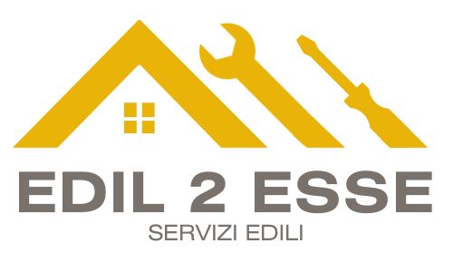

# Edil 2 Esse Website

Website for **Edil 2 Esse**, a construction company that operates in Livorno, Pisa and province (_Italy_)



> Company Info:
>
> - **VAT** (P IVA): 01790840498
> - Address: Via Bengasi, 97b - 57124 Livorno (LI)

## Description

The website is a showcase for the company, it contains a homepage, a page with the services offered, a page with the projects carried out and a contact page

## Technologies

The website is built with Next.js (React framework) and Tailwind CSS

## Installation

To run the website locally, clone the repository and run the following commands:

```bash
npm install
npm run dev
```

## License

- [MIT](LICENSE.md)

&nbsp;

---

&nbsp;

[**Go To Top &nbsp; ⬆️**](#edil-2-esse-website)
